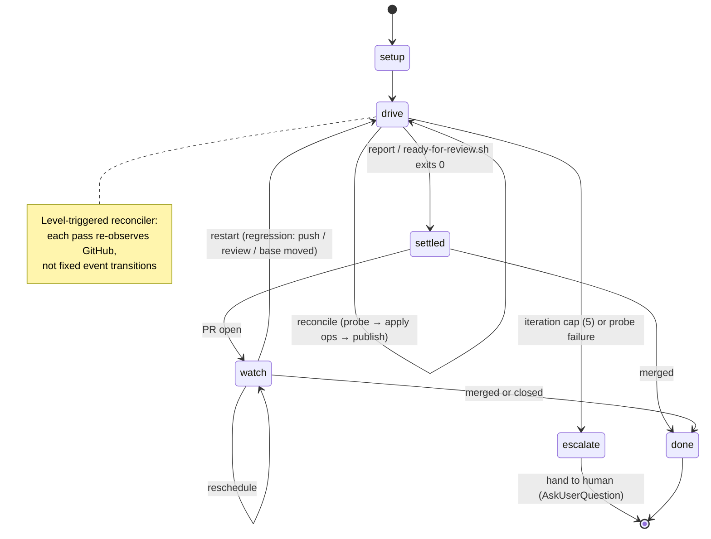

# Address PR — lifecycle (conceptual, rendered)

The full run is a **level-triggered reconciler**, not an event-driven state machine: each pass re-observes
the PR (GitHub is the real state) and acts to close the gap to `settled`. This is a **mental model**, not
persisted state — there is nothing to resume; every run re-derives status from the probe. The SKILL.md body
carries the same model as an ASCII diagram; this file is the GitHub-rendered version for humans.

| Stage | What happens | Next |
|-------|--------------|------|
| Setup | preflight, identify, fresh `init` | Drive |
| Drive | reconcile: probe → apply operations → publish | Settled; or Escalate at the iteration cap / probe failure |
| Settled | `ready-for-review.sh` exits 0; report + verdict | Watch (PR open) or Done (merged) |
| Watch | post-settle monitor; re-probe on a schedule | Drive (regression), Watch (reschedule), Done |
| Escalate | hit the 5-iteration cap or a probe failure — hand back to the human | terminal (AskUserQuestion) |
| Done | PR merged or closed | terminal |

Escalate and Done are the only true terminals. Watch looks terminal but isn't — it reschedules itself,
kicks back to Drive on a regression, or ends at Done. None of this is persisted; the probe re-derives the
current stage on every pass, so an interrupted run simply re-observes and continues.
