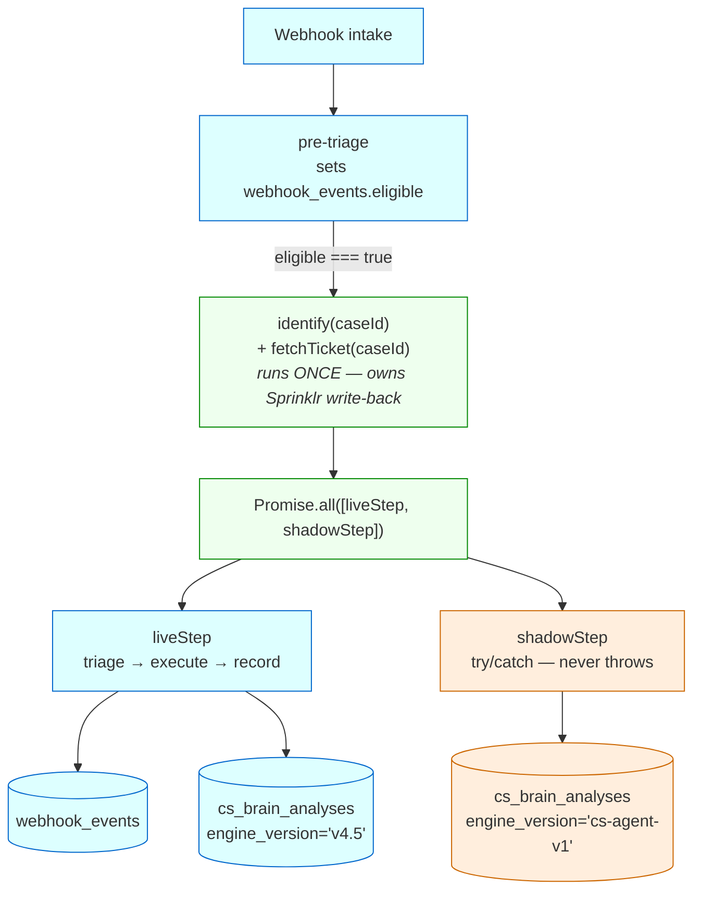
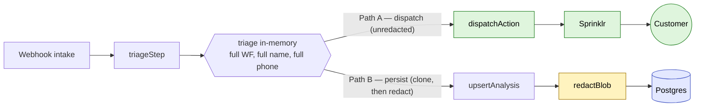
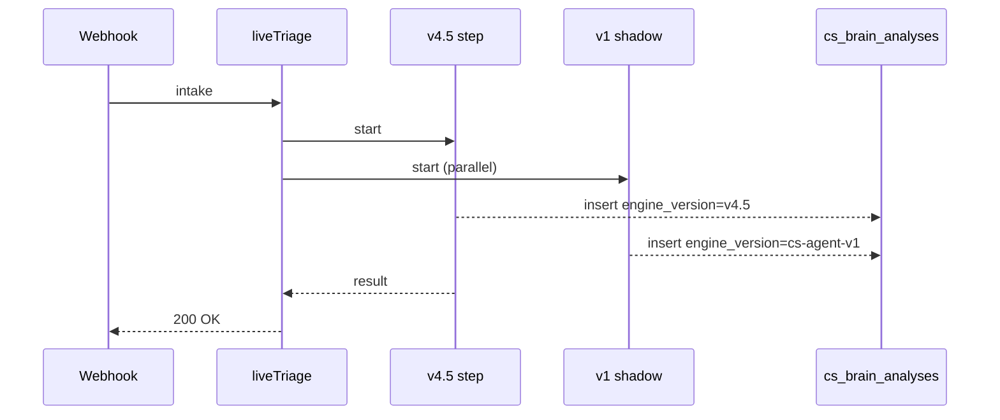

# Diagram recipes

When to use which, and copy-pasteable templates.

## Pick a diagram type

| Source describes | Use |
|---|---|
| Pipeline / fan-out / many-step flow | Mermaid `flowchart TD` or `LR` |
| Small state machine, ≤ 3 nodes | ASCII boxes |
| Sequence of events between systems | Mermaid `sequenceDiagram` (only when the order is the point) |
| Before / after of a single graph | Two ASCII columns side by side (per #683 Flip A) |

**Default lean:** Mermaid for anything ≥ 4 nodes; ASCII when the diagram fits in 4 lines.

Don't invent topology. If the source doesn't name nodes and edges (or arrows), skip the diagram and use a table instead.

## Recipe 1 — pipeline with side branches (Mermaid)

For shadow / parallel / fan-out architectures. Style classes mark live vs shadow vs shared.



Substitute the node names, keep the classDef colour vocabulary (`live`/`shadow`/`shared`).

## Recipe 2 — redact / clone path (Mermaid `flowchart LR`)

For privacy / data-handling diagrams where the point is "which path mutates, which doesn't".



## Recipe 3 — before / after flip (ASCII, side-by-side)

For small state changes — feature flag flips, engine swaps, ≤ 3 nodes.

```
         FLAG = false (today)                             FLAG = true (after flip)
         ===================                             ========================
  webhook                                          webhook
    │                                                │
    ├─► engine A ─► dispatch ─► customer ✉           ├─► engine A ─► (persist only)   ◄ shadow
    │                                                │
    └─► engine B (persist only)        ◄ shadow      └─► engine B ─► dispatch ─► customer ✉
```

## Recipe 4 — decision tree (ASCII)

For gating / matching logic with named branches. Keep it ≤ 6 lines.

```
  gate.evaluateGate(output)
        │
        ├─ no structural match           ─► gate=no_go:<reason>
        ├─ match, enabled === false      ─► gate=ready:<ruleId>   ◄ "would have fired"
        └─ match, enabled === true       ─► gate=go:<ruleId>      ◄ executes
```

## Recipe 5 — sequence (Mermaid, sparingly)

Only when the *order* of events between systems is the discussion point. Otherwise prefer a flowchart.



## Style rules

- **Quote labels that contain punctuation** in Mermaid — `["text with (parens)"]`, not `[text with (parens)]`.
- **Use `<br/>` for line breaks** inside Mermaid nodes, not `\n`.
- **One Mermaid block per issue.** A second diagram usually means the first is doing too much; split into two issues.
- **Don't paste auto-generated diagrams from tools** without checking that every node name appears in the surrounding prose. If a node doesn't earn a mention in the body, it doesn't belong in the diagram.
- **No colour for ASCII.** Use box characters and arrows only.

## When *not* to include a diagram

- A 1-step or 2-step change. Sentence + table is shorter.
- A list of files modified. That's a table, not a graph.
- Anything where the diagram is only "X → Y". Use prose.
